# AI / ML System Design — Interview Prep Guide

A comprehensive reference covering ML fundamentals, system design steps, metrics frameworks, CPU vs GPU model deployment, offline vs online evaluation, and business-metric fluency — structured for system-design interviews and real-world ML engineering.

> **Visual diagrams** are included throughout — see the `images/` directory for high-resolution versions.

---

## Table of Contents

| #  | Section | Description |
|----|---------|-------------|
| 0  | [AI/ML Primer](#0-aiml-primer--foundations) | Core ML concepts, types of learning, training loop, key terminology |
| 1  | [CPU Models vs GPU Models](#1-cpu-models-vs-gpu-models) | When to deploy on CPU vs GPU, cost/latency tradeoffs |
| 2  | [ML Metrics Framework Tied to Revenue](#2-ml-metrics-framework-tied-to-revenue-and-business-value) | Five-layer metric stack, North Star / leading / guardrail pattern |
| 3  | [System Design Steps Framework](#3-system-design-steps-framework) | Six-step ML system design interview structure |
| 4  | [Offline vs Online Metrics](#4-offline-vs-online-metrics) | Definitions, properties, and real-world examples per system type |
| 5  | [Business Metrics Definitions](#5-business-metrics-definitions-ctr-cpc-cpm-cpa-cvr-roas) | CTR, CPC, CPM, CPA, CVR, ROAS with funnel diagram |
| 6  | [Deep Dive — Offline Metrics](#6-deep-dive--offline-metrics-for-beginners) | Beginner-friendly but grad-school-level explanation with diagrams |
| 7  | [Metric-by-Metric Explanation by Model Type](#7-metric-by-metric-explanation-by-model-type) | Classification, regression, ranking, NLP/GenAI, clustering |
| 8  | [Cross-Cutting Themes](#8-cross-cutting-themes) | Layered evaluation, metrics → revenue, offline ≠ online |
| 9  | [Reusable Interview Framework](#9-reusable-interview-framework-one-page-cheat-sheet) | Compact cheat sheet you can use in any ML system-design round |

---

## 0. AI/ML Primer — Foundations

> Start here if you need to build intuition before diving into metrics and system design.

### 0.1 What is Machine Learning?

Machine learning is a way to build software that **learns patterns from data** instead of being explicitly coded with rules.

| Traditional programming | Machine learning |
|------------------------|-----------------|
| Human writes rules → code processes data → output | Human provides data + answers → algorithm finds rules → model makes predictions |

**Real-world analogy**: Instead of writing 10,000 `if/else` rules to detect spam email, you give the algorithm 1 million emails labeled "spam" or "not spam" and let it figure out the patterns itself.

### 0.2 Types of Machine Learning

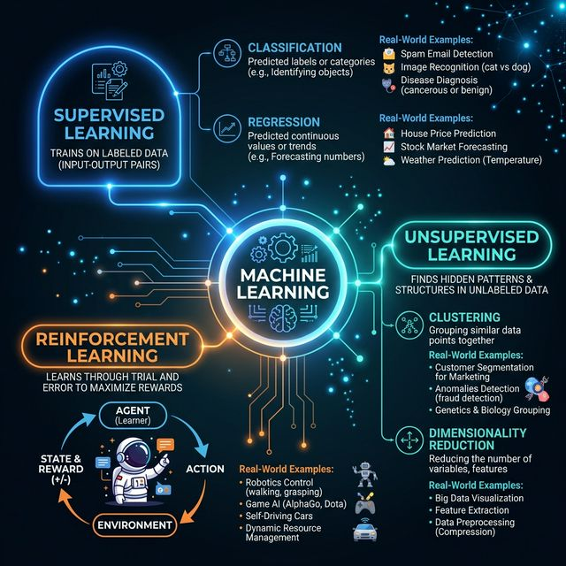

#### Supervised Learning — "learning with a teacher"

You give the model **input data + correct answers (labels)**. It learns the mapping.

| Sub-type | What it predicts | Real-world example |
|----------|-----------------|-------------------|
| **Classification** | A category / class | Spam or not spam? Fraud or not fraud? Cat or dog? |
| **Regression** | A continuous number | What will the house price be? What is the ETA? |

**How it works** (simplified):
```
 Training data:
   Email 1: "Buy cheap watches now!!!"  → Label: SPAM
   Email 2: "Meeting at 3pm tomorrow"   → Label: NOT SPAM
   Email 3: "You won $1,000,000!!!"     → Label: SPAM
   ... (millions more)

 Model learns:
   Words like "cheap", "buy now", "won" → high spam probability
   Words like "meeting", "tomorrow"     → low spam probability

 New email: "Buy luxury items cheap!"
 Model predicts: SPAM (87% confidence)
```

#### Unsupervised Learning — "learning without a teacher"

You give the model data **without labels**. It finds hidden structure.

| Sub-type | What it does | Real-world example |
|----------|--------------|--------------------|
| **Clustering** | Groups similar items together | Group customers into segments for marketing |
| **Dimensionality reduction** | Compress data while keeping patterns | Reduce 1,000 features to 50 for visualization |
| **Anomaly detection** | Find unusual data points | Detect unusual network traffic (security) |

#### Reinforcement Learning — "learning by trial and error"

An **agent** takes actions in an **environment**, gets **rewards or penalties**, and learns the best strategy.

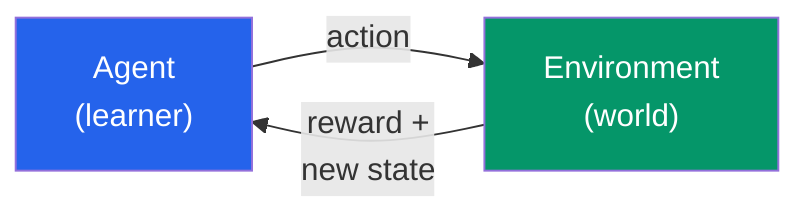

**Examples**: Game AI (AlphaGo, chess), self-driving cars, robotics, dynamic pricing.

### 0.3 Key Terminology

| Term | Plain English | Example |
|------|---------------|---------|
| **Feature** | An input variable the model uses to make predictions | Email length, number of exclamation marks, sender domain |
| **Label** | The correct answer (in supervised learning) | "spam" or "not spam" |
| **Training** | The process of learning patterns from data | Showing the model millions of labeled examples |
| **Inference** | Using a trained model to make predictions on new data | Running the spam model on an incoming email |
| **Model** | The learned mathematical function | A neural network with tuned weights |
| **Epoch** | One full pass through all training data | If you have 1M examples, one epoch = seeing all 1M |
| **Batch** | A subset of data processed at once | Process 64 examples at a time |
| **Hyperparameter** | A setting you choose before training | Learning rate, number of layers, batch size |
| **Loss function** | Measures how wrong the model's predictions are | Cross-entropy for classification, MSE for regression |
| **Gradient descent** | The algorithm that adjusts weights to reduce loss | "Walk downhill" on the loss surface |

### 0.4 The Training Loop — How Models Learn

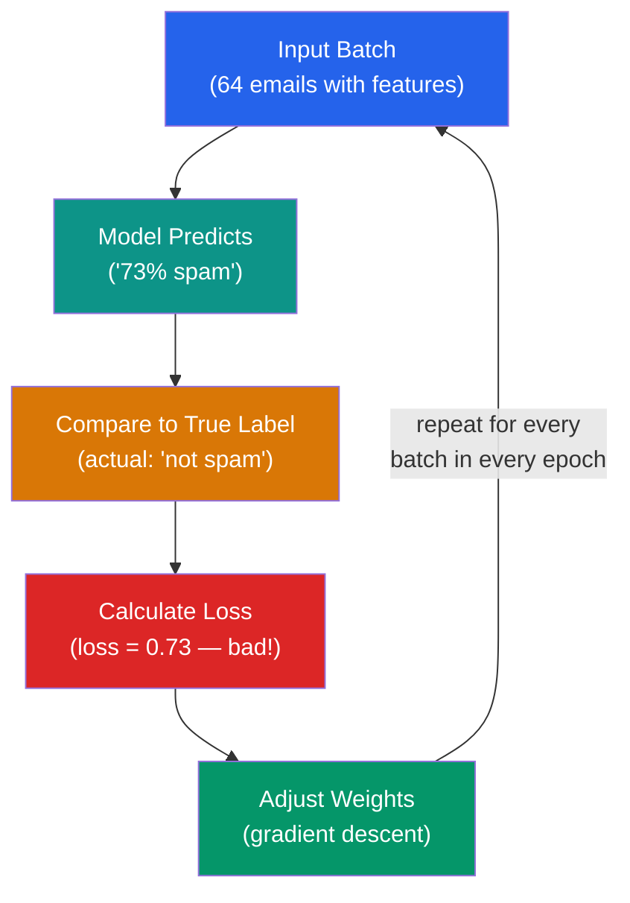

**Analogy**: Learning to shoot free throws.
1. You shoot (prediction)
2. You see if it went in (compare to label)
3. You notice you shot too far left (calculate loss)
4. You adjust your aim slightly right (gradient descent)
5. Repeat thousands of times until you're accurate

### 0.5 Overfitting vs Underfitting

| Concept | What it means | Analogy | How to detect |
|---------|---------------|---------|---------------|
| **Underfitting** | Model is too simple — misses patterns | Studying only chapter 1 for a 10-chapter exam | Low accuracy on *both* training and test data |
| **Good fit** | Model captures real patterns | Studying all chapters and understanding the concepts | High accuracy on both training and test data |
| **Overfitting** | Model memorizes training data, fails on new | Memorizing exact practice exam answers but failing on new questions | High accuracy on training, *low* on test data |

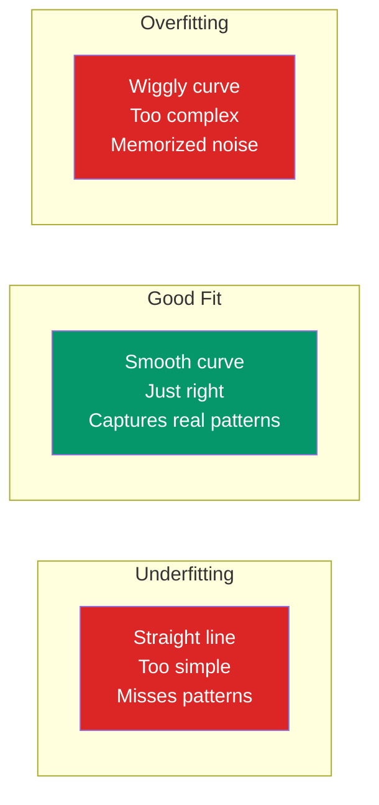

### 0.6 Train / Validation / Test Split

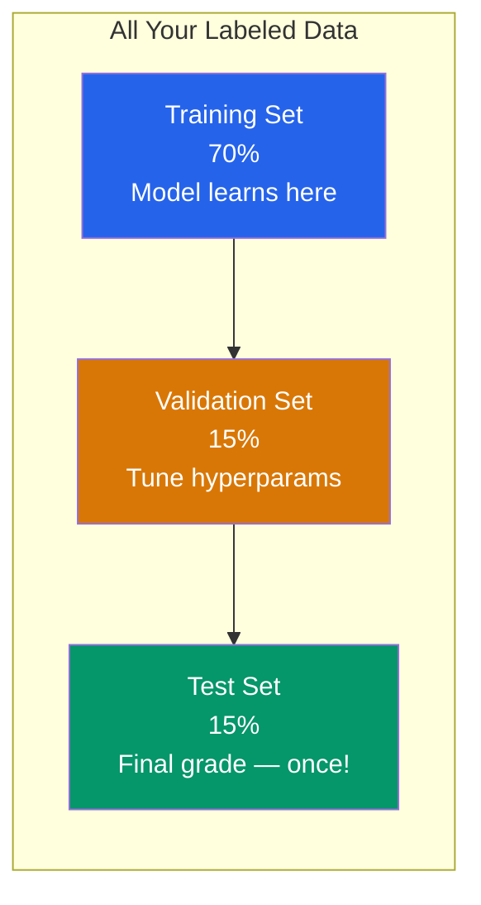

| Set | Purpose | When used | Analogy |
|-----|---------|-----------|---------|
| **Training** | Model learns from this data | Every epoch | Textbook + homework |
| **Validation** | Tune settings, check for overfitting | During development | Practice exams |
| **Test** | Final honest evaluation | Once, at the end | Final exam |

### 0.7 End-to-End ML Pipeline (The Big Picture)

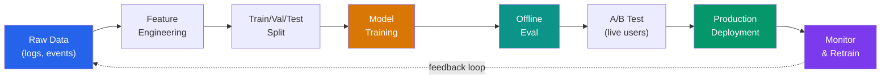

> **Key insight**: ML is not "train once and deploy." It is a continuous loop of data → train → evaluate → deploy → monitor → retrain.

---

## 1. CPU Models vs GPU Models

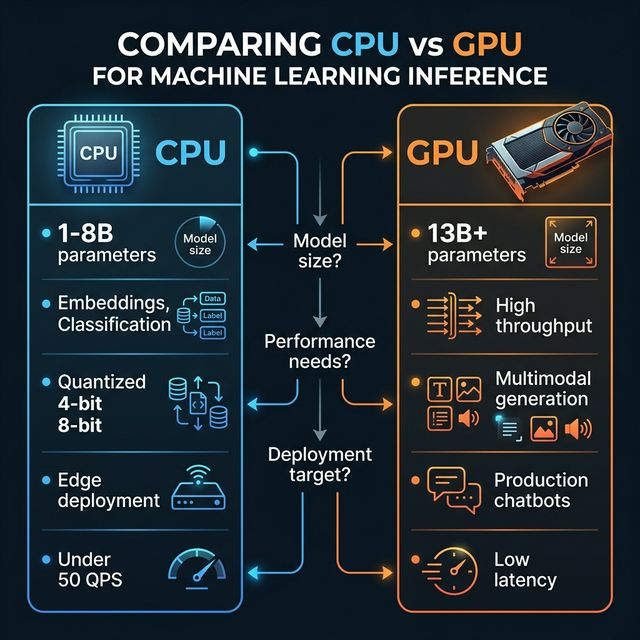

### 1.1 When to use a CPU

| Use-case | Why CPU works |
|----------|---------------|
| Small LLMs (1 B – 8 B params) | Model fits in RAM; no GPU overhead needed |
| Quantized models (4-bit / 8-bit) | Quantization shrinks memory & compute; CPUs handle it efficiently |
| Encoder models (BERT, DistilBERT) | Classification, embeddings, reranking — low arithmetic intensity |
| Speech / OCR / classical vision | Many frameworks (ONNX Runtime, OpenVINO) are CPU-optimized |
| Edge / on-prem / low-volume internal tools | Simpler ops, no GPU driver stack, lower cost |

### 1.2 When to use a GPU

| Use-case | Why GPU is needed |
|----------|-------------------|
| Large LLMs (13 B+ params) | Need massive VRAM and parallel throughput |
| High-throughput / low-latency generation | GPU FLOPS vastly exceed CPU for matrix math |
| Long-context inference | Attention scales quadratically; GPUs parallelize it |
| Image / video / multimodal generation | Diffusion, GANs, vision transformers need GPU tensor cores |
| Multi-user production chatbots | Concurrent request batching is GPU-native |

### 1.3 Core difference — why it matters

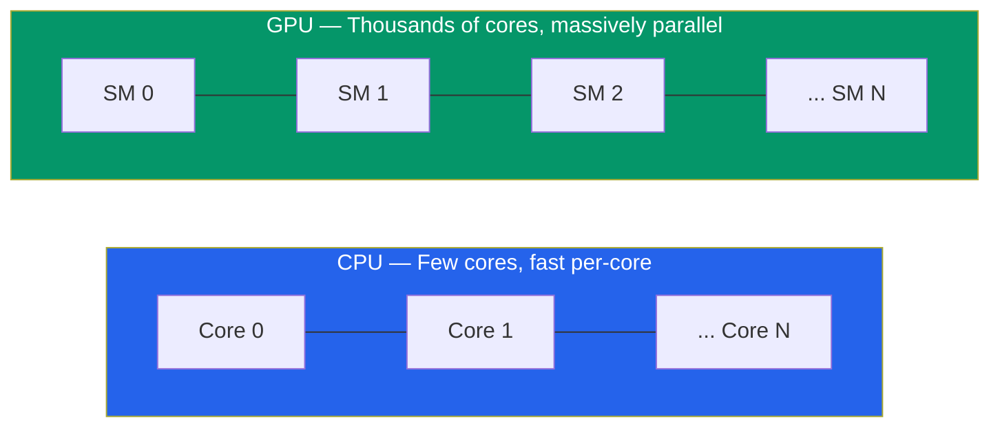

GPUs excel at the highly parallel matrix multiplications that dominate neural-network inference. CPUs are better when the workload is sequential, small, or I/O-bound.

### 1.4 Decision heuristic

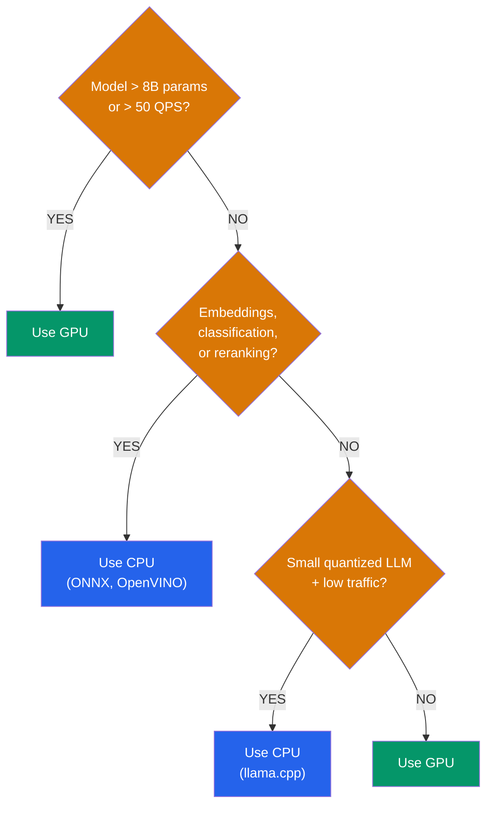

### 1.5 Practical rule of thumb

* **CPU-first**: embeddings, classification, search ranking, low-volume internal chat, small quantized LLMs.
* **GPU**: latency-sensitive generation, high concurrency, large models, multimodal, production chatbots.

---

## 2. ML Metrics Framework Tied to Revenue and Business Value

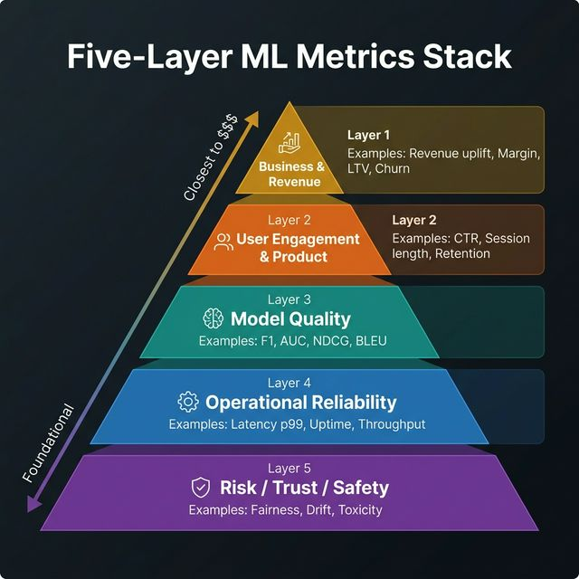

### 2.1 Five-layer metric stack

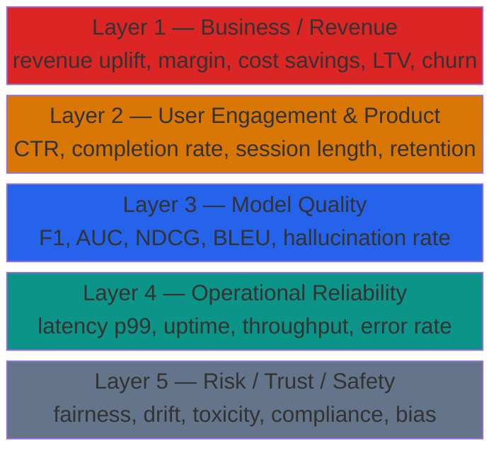

### 2.2 Design metrics from business impact backward

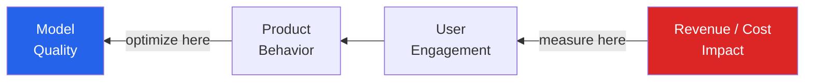

### 2.3 North Star + leading indicators + guardrails

| Layer | What it answers | Examples |
|-------|----------------|----------|
| **North Star** | "Are we making money / saving money?" | Revenue uplift, conversion, margin, retention |
| **Leading indicators** | "Is the product behaving well?" | CTR, completion rate, acceptance rate, F1, NDCG, groundedness |
| **Guardrails** | "Is anything breaking or unsafe?" | Latency p99, uptime, safety, fairness, drift, halluc. rate |

### 2.4 Metrics by ML system type

| System | Offline | Online / Business |
|--------|---------|-------------------|
| **Recommendations** | Precision@K, Recall@K, NDCG | CTR, add-to-cart, conversion, revenue/session |
| **Fraud detection** | Precision, Recall, PR-AUC, FPR | Blocked fraud $, complaint rate, approval rate |
| **Copilots / assistants** | Answer quality, groundedness | Task completion, deflection, resolution, CSAT |
| **Forecasting** | MAE, RMSE, MAPE | Margin improvement, stockout reduction |
| **Ads ranking** | AUC, log loss, calibration | CTR, CPC, CPM, revenue, advertiser ROI |
| **Search** | MRR, relevance, NDCG | Search success, reformulation rate, conversion |

### 2.5 Reusable executive review structure

When presenting an ML project to leadership, use four buckets:

1. **Value** — what business metric moved?
2. **Product pull** — are users engaging?
3. **ML quality** — are offline metrics improving?
4. **Production health** — is the system reliable and safe?

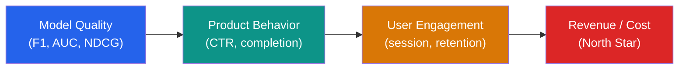

---

## 3. System Design Steps Framework

> Use this six-step structure in any ML system-design interview.

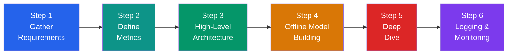

### Step 1 — Gather Requirements

**Goal**: Understand the business problem, user need, and engineering constraints before touching any models.

| Area | Questions to ask |
|------|-----------------|
| Business objective | What business metric does this serve? |
| User problem | What is the user trying to do? |
| Scale | How many users / requests / items? |
| Latency | What is the acceptable response time? |
| Throughput | Peak QPS? Batch or real-time? |
| Data | What data is available? Labels? Volume? Freshness? |
| Constraints | Regulatory, privacy, cost, infra, team size? |
| Assumptions | State them explicitly and validate |

**Flow**:

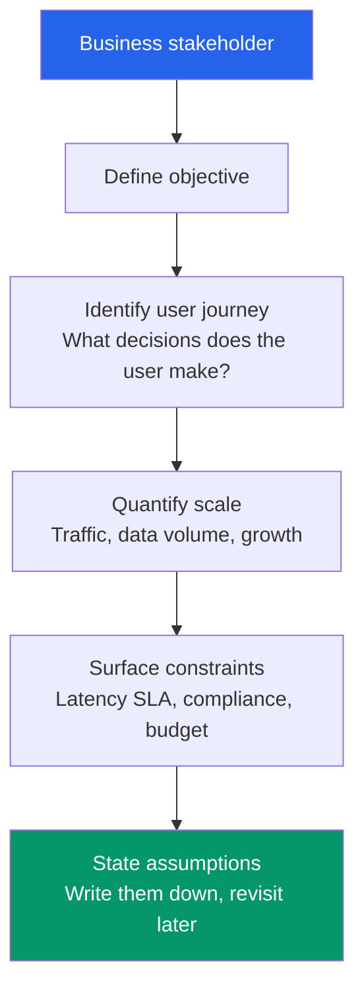

> **Tip**: In an interview, spend the first 3–5 minutes here. Interviewers reward clarity and structured thinking.

---

### Step 2 — Define Metrics

**Goal**: Establish how you will measure success — both technically and in terms of business impact.

| Metric category | Purpose | Example |
|----------------|---------|---------|
| **Offline metrics** | Evaluate model on historical data | F1, AUC, NDCG, RMSE |
| **Online metrics** | Measure impact on real users | CTR, conversion, CSAT, watch time |
| **Guardrail metrics** | Ensure nothing breaks | Latency p99, error rate, drift, fairness |

**Key principle**: Offline metrics are the *first gate*. Online metrics are the *deployment decision*. Guardrails are the *safety net*.

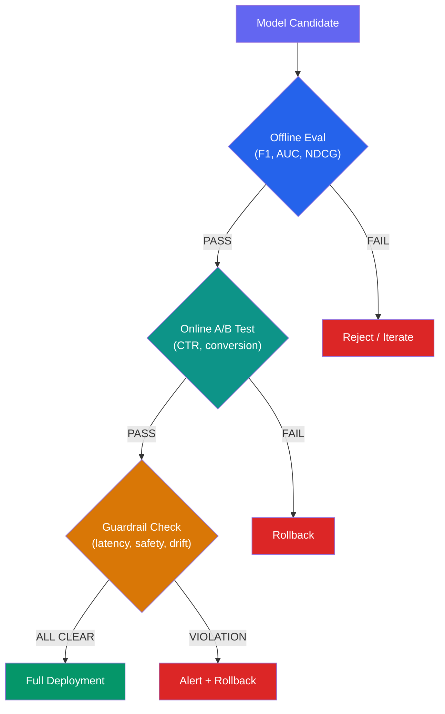

---

### Step 3 — High-Level Architecture

**Goal**: Draw the end-to-end system, from data ingestion to model serving to monitoring.

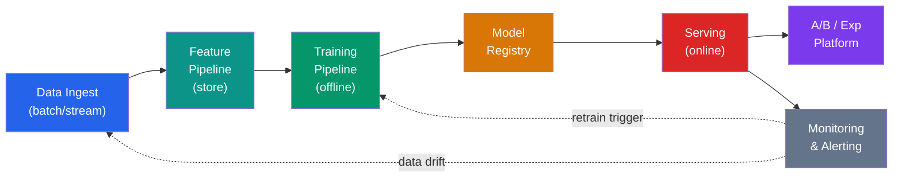

For each box, briefly describe:
* **What** it does
* **How** it connects to the other boxes
* **Key tradeoffs** (batch vs stream, feature store vs inline, shadow vs canary deploy)

---

### Step 4 — Offline Model Building

**Goal**: For each component, propose at a high level how you would build the model end-to-end.

This step covers **five sub-areas** that you should address for every ML component in your system:

#### 4.1 Data Generation

Define where training data comes from and how labels are obtained.

| Data source | How labels are created | Real-world example |
|-------------|----------------------|--------------------|
| **User interaction logs** | Implicit labels from clicks, purchases, skips | Recommendation: click = positive, skip = negative |
| **Human annotation** | Paid annotators label data | Content moderation: annotators label toxic vs safe |
| **Heuristic / rule-based** | Business rules generate noisy labels | Fraud: chargebacks within 30 days = fraud label |
| **Semi-supervised** | Small labeled set + large unlabeled set | Medical imaging: few expert-labeled scans + thousands unlabeled |
| **Synthetic / augmented** | Programmatically generate training examples | Self-driving: simulated driving scenarios |
| **Active learning** | Model queries uncertain examples for human labeling | NLP: model flags low-confidence predictions for review |

**Key questions**:
* How much labeled data do we have? Is it enough?
* Are the labels clean, or noisy? What is the label quality?
* Is there class imbalance? (e.g., 99.9% non-fraud, 0.1% fraud)
* How fresh does the data need to be? (daily, hourly, real-time?)

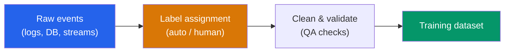

#### 4.2 Featurization

Define the features (inputs) the model will use.

| Feature category | Description | Example |
|-----------------|-------------|--------|
| **User features** | Properties of the user | Age, location, purchase history, session count |
| **Item features** | Properties of the item | Category, price, popularity, freshness |
| **Context features** | Situational signals | Time of day, device, location, day of week |
| **Interaction features** | User × item signals | Past clicks on this category, purchase frequency |
| **Embedding features** | Learned dense representations | User embedding, item embedding, text embedding |
| **Cross features** | Combinations of raw features | User-age × item-category, time × location |

**Key considerations**:

| Concern | Why it matters | Mitigation |
|---------|---------------|------------|
| **Feature leakage** | Future information leaks into training → inflated offline metrics | Strict time-based splits; audit feature timestamps |
| **Feature freshness** | Stale features degrade predictions | Real-time feature store (e.g., Feast, Tecton) |
| **Feature drift** | Distribution of features shifts over time | Monitor distributions; retrain triggers |
| **Missing values** | Some features unavailable for some users/items | Default values, imputation, or model handles nulls |

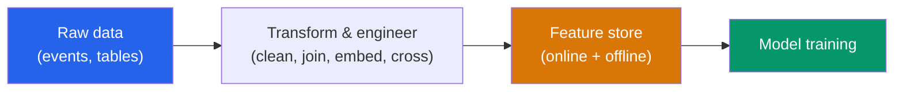

#### 4.3 Model Training

Choose and justify the model architecture and training approach.

| Decision | Options | Tradeoff |
|----------|---------|----------|
| **Model type** | Logistic regression, XGBoost, deep NN, transformer | Complexity vs accuracy vs latency vs interpretability |
| **Architecture** | Two-tower, multi-task, sequence model, ensemble | Depends on the retrieval vs ranking stage |
| **Training approach** | Offline batch, online learning, fine-tuning, transfer learning | Freshness vs stability vs compute cost |
| **Loss function** | Cross-entropy, hinge, LambdaRank, contrastive, RLHF | Must align with the offline metric you chose in Step 2 |
| **Regularization** | L1, L2, dropout, early stopping | Prevent overfitting |
| **Negative sampling** | Random, hard negatives, in-batch | Affects retrieval quality |

**Interview flow — always start simple**:

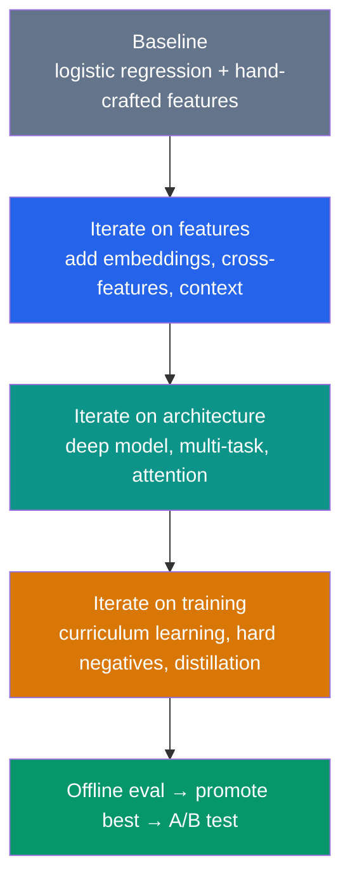

> **Interview tip**: Interviewers reward candidates who start with a baseline and clearly articulate *why* each iteration is an improvement.

#### 4.4 Evaluation Strategies

**Articulate which metric each component is focusing on.**

In a multi-component system, different components optimize for different metrics:

| Component | Primary metric | Why this metric? | Example |
|-----------|---------------|-------------------|--------|
| **Candidate generation** | Recall@K | Must retrieve all potentially relevant items | Recall@1000 for initial retrieval |
| **Ranking** | NDCG | Must put best items at the top | NDCG@10 for the final displayed list |
| **Filtering / safety** | Precision | Must not let bad content through | Precision for content moderation |
| **Calibration** | Log loss / Brier score | Predicted probabilities must be accurate | Ad CTR prediction |
| **Embedding model** | Similarity metrics | Nearest neighbors must be semantically similar | Cosine similarity on eval pairs |

**Real-world example — e-commerce recommendation system**:

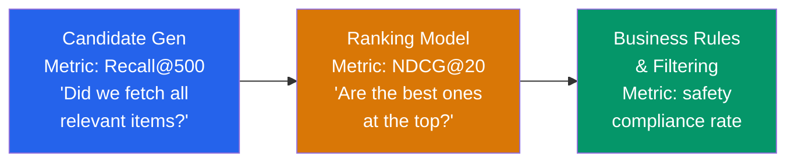

#### 4.5 Tie Component Metrics to the Overall System Metric

Each component metric should **connect upward** to the North Star business metric.

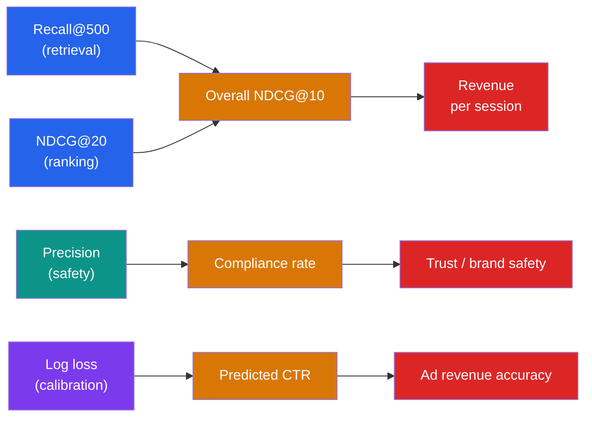

**Key interview point**: When asked "what metric would you use?", don't just say "F1" — explain:
1. Which specific component uses which metric
2. Why that metric is the right one for that component
3. How it ties to the overall system success
4. What the tradeoff is (e.g., optimizing recall hurts latency at serving time)

| System | Candidate gen metric | Ranking metric | Business (online) metric |
|--------|---------------------|----------------|-------------------------|
| **E-commerce** | Recall@500 | NDCG@10 | Revenue/session |
| **Search** | Recall@100 | MRR, NDCG@5 | Search success rate |
| **Ads** | Coverage | AUC, log loss | Revenue, advertiser ROI |
| **Feed** | Recall@1000 | Engagement score | Session time, DAU |
| **Fraud** | Recall (catch fraud) | Precision (reduce FP) | Fraud loss avoided |

---

### Step 5 — Deep Dive

**Goal**: Go deep on one component. The interviewer will usually pick one, or you can proactively choose.

Common deep-dive topics:

| Component | What to discuss |
|-----------|----------------|
| Feature engineering | Feature freshness, leakage, drift, storage |
| Model architecture | Layer design, embedding dims, attention heads |
| Serving latency | Caching, batching, model distillation, quantization |
| Data pipeline | Exactly-once, backfill, schema evolution |
| Cold start | New users, new items — fallback strategies |
| Fairness / bias | Disparity metrics, mitigation, auditing |
| Scaling | Sharding, horizontal scale, load balancing |
| Failure modes | Graceful degradation, fallback models, circuit breakers |

**Approach**:

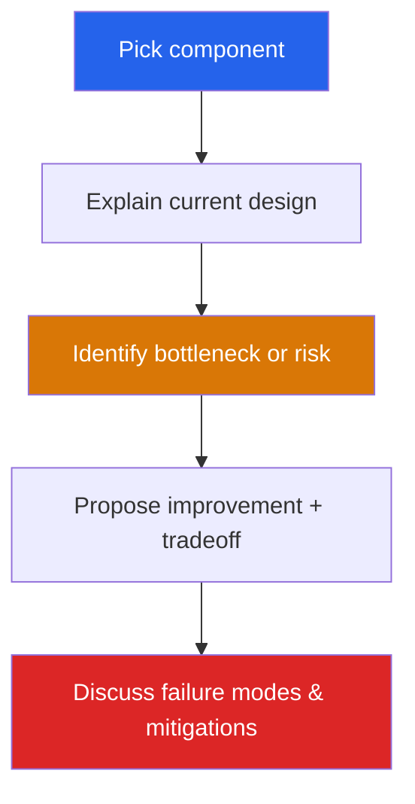

---

### Step 6 — Logging, Monitoring & Observability *(optional but impressive)*

**Goal**: Show that you think about production as a continuous loop, not a one-time deployment.

| What to track | Examples |
|---------------|---------|
| Model metrics | Prediction distribution, confidence, drift |
| Product metrics | CTR, conversion, engagement — dashboarded |
| Operational health | Latency p50/p99, error rate, throughput, CPU/GPU util |
| Trust / safety | Toxicity, fairness scores, compliance flags |
| Retraining signals | Data drift, concept drift, label freshness |

**Monitoring loop**:

```mermaid
flowchart TD
    A["Production Traffic"] --> B["Log predictions + features + outcomes"]
    B --> C["Compute monitoring metrics\n(batch / stream)"]
    C --> D{"Threshold\nviolation?"}
    D -->|No| A
    D -->|Yes| E["Alert + Investigate"]
    E --> F{"Severity?"}
    F -->|High| G["Rollback model"]
    F -->|Low| H["Trigger retraining"]
    H --> A
    G --> A
    style D fill:#d97706,color:#fff
    style G fill:#dc2626,color:#fff
    style H fill:#059669,color:#fff
```

---

## 4. Offline vs Online Metrics

### 4.1 Offline metrics — what & why

**Definition**: Metrics computed on historical or held-out labeled data, *before* deployment.

**They help answer**:
* Is the model technically better than the baseline?
* Should we reject obviously bad or risky model versions?
* Which candidate should move to live testing?

**Properties**:

| Property | Detail |
|----------|--------|
| Speed | Fast — no live traffic needed |
| Cost | Cheap — just compute on stored data |
| Safety | Safe — no user impact |
| Limitation | Local view; does not capture full system behavior |
| Optimization | Can often be directly optimized (loss = metric) |

### 4.2 Online metrics — what & why

**Definition**: Metrics measured on live traffic with real users, usually via A/B tests.

**They help answer**:
* Did the model improve the actual product?
* Should the model be fully deployed?
* Did business outcomes improve?

**Properties**:

| Property | Detail |
|----------|--------|
| Speed | Slow — needs live traffic and statistical power |
| Cost | Expensive — engineering, traffic, risk |
| Truth | High — measures real user behavior |
| Deployment | Usually the *deployment decision* |
| Optimization | Cannot optimize directly; measured, not trained on |
| Rigor | Requires hypothesis testing, power analysis |

### 4.3 The gap: offline wins ≠ online wins

> **Critical insight for interviews**: A model can improve NDCG by 3% offline and *still hurt* revenue online.

Why? Because:
* Offline data has selection bias (you only see outcomes for items that *were* shown)
* The full system (UI, ranking pipeline, other models) interacts in ways offline data cannot capture
* User behavior is dynamic — past labels may not reflect current preferences

### 4.4 Real-world offline vs online metrics by system

#### Recommendation systems

| Offline | Online |
|---------|--------|
| NDCG, Recall@K, Precision@K | CTR, add-to-cart rate, conversion rate, revenue/session |

#### Search ranking

| Offline | Online |
|---------|--------|
| MRR, relevance, NDCG | Search success rate, reformulation rate, conversion after search |

#### Fraud detection

| Offline | Online |
|---------|--------|
| Precision, Recall, PR-AUC, FPR | Blocked fraud dollars, complaint rate, approval rate |

#### Ads ranking

| Offline | Online |
|---------|--------|
| AUC, log loss, calibration | CTR, CPC, CPM, revenue, advertiser ROI |

#### Video recommendation

| Offline | Online |
|---------|--------|
| Ranking quality metrics | Watch time, session length, retention, churn |

#### Ride-share ETA

| Offline | Online |
|---------|--------|
| RMSE, MAE, MAPE | Cancellation rate, ride completion, CSAT |

#### LLM / Chatbots

| Offline | Online |
|---------|--------|
| Answer quality, groundedness, hallucination rate, benchmarks | Task completion, escalation rate, CSAT, retention |

---

## 5. Business Metrics Definitions: CTR, CPC, CPM, CPA, CVR, ROAS

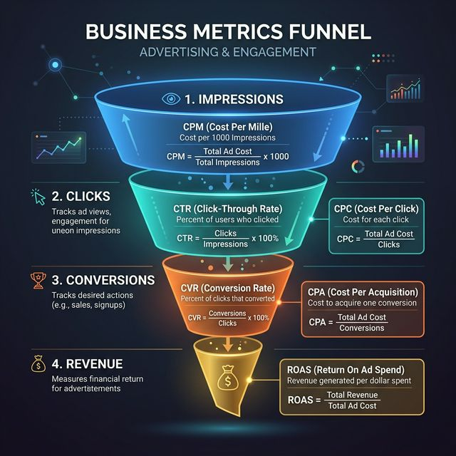

### 5.1 Definitions

| Metric | Full Name | Formula | What it measures |
|--------|-----------|---------|-----------------|
| **CTR** | Click-Through Rate | `Clicks / Impressions` | How often shown items are clicked |
| **CPC** | Cost Per Click | `Spend / Clicks` | How much each click costs |
| **CPM** | Cost Per Mille | `(Spend / Impressions) × 1000` | Cost per 1,000 views |
| **CPA** | Cost Per Acquisition | `Spend / Conversions` | Cost to get a purchase / signup |
| **CVR** | Conversion Rate | `Conversions / Clicks` | How often clicks turn into outcomes |
| **ROAS** | Return on Ad Spend | `Revenue / Ad Spend` | Business return from ad spend |

### 5.2 Funnel view

```mermaid
flowchart LR
    A["Impressions\n(CPM)"] --> B["Clicks\n(CPC)"]
    B --> C["Conversions\n(CPA)"]
    C --> D["Revenue\n(ROAS)"]
    A ---|CTR| B
    B ---|CVR| C
    style A fill:#64748b,color:#fff
    style B fill:#2563eb,color:#fff
    style C fill:#d97706,color:#fff
    style D fill:#059669,color:#fff
```

### 5.3 Why this matters for ML interviews

> **Key lesson**: A model can improve **CTR** but still *reduce revenue* if users click more but convert less.

* **CTR** is a useful *leading metric* — it shows engagement.
* **Conversion** and **revenue** are stronger *business outcomes*.
* In an interview, always mention the gap between engagement metrics and business metrics.

---

## 6. Deep Dive — Offline Metrics for Beginners

### 6.1 What are offline metrics?

Offline metrics evaluate a trained model on data it has *never seen during training*. You run the model on a held-out test set, compare predictions to ground-truth labels, and compute a score.

**Analogy**: Offline evaluation is like a practice exam. It tells you whether you studied enough, but it does not guarantee you will pass the real exam.

### 6.2 End-to-end pipeline

```mermaid
flowchart TD
    A["Raw data"] --> B["Label / annotate"]
    B --> C["Split into Train / Validation / Test"]
    C --> D["Train 70%"]
    C --> E["Validation 15%"]
    C --> F["Test 15%"]
    D --> G["Train model"]
    E --> H["Tune hyperparams"]
    F --> I["Final eval"]
    I --> J["Compute metrics\n(accuracy, F1, NDCG, RMSE)"]
    style D fill:#2563eb,color:#fff
    style E fill:#d97706,color:#fff
    style F fill:#059669,color:#fff
    style J fill:#7c3aed,color:#fff
```

### 6.3 Why use offline evaluation?

| Reason | Explanation |
|--------|-------------|
| **Fast** | Seconds to minutes — no live traffic |
| **Cheap** | Just compute, no user exposure |
| **Safe** | No risk to real users |
| **Repeatable** | Run it again and again on the same test set |
| **First gate** | Filters out bad models before they touch production |

### 6.4 Why offline evaluation is not enough

| Limitation | Explanation |
|------------|-------------|
| **Selection bias** | You only have labels for items that were shown |
| **Static** | Does not capture user behavior changes |
| **System effects** | Does not account for other components (UI, caching, other models) |
| **Proxy** | The offline metric may not correlate perfectly with business outcome |

### 6.5 Where offline eval fits in the system design flow

```mermaid
flowchart TD
    A["Build candidate model"] --> B{"Offline eval\n(test set)"}
    B -->|PASS| C{"Online A/B test\n(live traffic)"}
    B -->|FAIL| X1["Iterate / discard"]
    C -->|PASS| D["Full rollout"]
    C -->|FAIL| X2["Rollback"]
    style A fill:#2563eb,color:#fff
    style B fill:#d97706,color:#fff
    style C fill:#0d9488,color:#fff
    style D fill:#059669,color:#fff
    style X1 fill:#dc2626,color:#fff
    style X2 fill:#dc2626,color:#fff
```

**Analogy**: Offline eval = driving simulator. Online eval = real road test. You would never skip the simulator, but you would never certify a driver *only* on the simulator.

---

## 7. Metric-by-Metric Explanation by Model Type

### 7.1 Classification

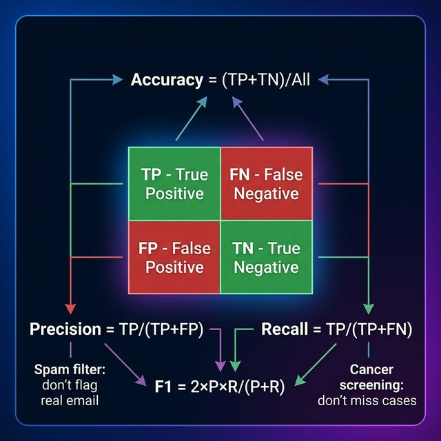

#### Confusion matrix — the foundation

```mermaid
flowchart LR
    subgraph "Confusion Matrix"
        direction TB
        subgraph "Predicted Positive"
            TP["TP\nTrue Positive"]
            FP["FP\nFalse Positive"]
        end
        subgraph "Predicted Negative"
            FN["FN\nFalse Negative"]
            TN["TN\nTrue Negative"]
        end
    end
    style TP fill:#059669,color:#fff
    style TN fill:#059669,color:#fff
    style FP fill:#dc2626,color:#fff
    style FN fill:#dc2626,color:#fff
```

#### Metrics

| Metric | Formula | Plain English | When to use |
|--------|---------|---------------|-------------|
| **Accuracy** | `(TP + TN) / Total` | Overall correctness | Balanced classes only |
| **Precision** | `TP / (TP + FP)` | Of all predicted positives, how many are actually positive? | When FP is costly (spam filter, fraud alert) |
| **Recall** | `TP / (TP + FN)` | Of all actual positives, how many did we catch? | When FN is costly (disease detection, fraud loss) |
| **F1 Score** | `2 × (P × R) / (P + R)` | Harmonic mean of precision & recall | When you need a single balanced score |
| **AUC-ROC** | Area under ROC curve | Separability across all thresholds | Ranking quality for binary classifiers |
| **PR-AUC** | Area under Precision-Recall curve | Performance on the positive class | Imbalanced datasets (fraud, rare events) |

#### Examples

* **Spam filter**: High precision (don't put real email in spam).
* **Cancer screening**: High recall (don't miss a real case).
* **Fraud detection**: Balance both — PR-AUC is the go-to metric.

---

### 7.2 Regression

| Metric | Formula | Plain English | When to use |
|--------|---------|---------------|-------------|
| **MAE** | `mean(|y - ŷ|)` | Average absolute error | General-purpose, interpretable |
| **RMSE** | `√mean((y - ŷ)²)` | Penalizes large errors more | When large errors are especially bad |
| **MAPE** | `mean(|y - ŷ| / |y|) × 100` | Percentage error | When relative error matters (pricing, demand) |
| **R²** | `1 - SS_res / SS_tot` | Fraction of variance explained | Model explanatory power |

#### Examples

* **ETA prediction**: RMSE (penalize wildly wrong ETAs).
* **Demand forecasting**: MAPE (a 10-unit error means different things for 100 vs 10,000 units).
* **House price prediction**: MAE in dollars — easy to explain to stakeholders.

---

### 7.3 Ranking / Recommendation

| Metric | Plain English | Example |
|--------|---------------|---------|
| **Precision@K** | Of the top K results, how many are relevant? | Top-10 product recommendations |
| **Recall@K** | Of all relevant items, how many appear in the top K? | Search recall |
| **NDCG** | Rewards putting relevant items *higher* in the list | Search ranking, feed ranking |
| **MAP** | Average precision across many queries | Information retrieval |
| **MRR** | How quickly does the *first* relevant item appear? | QA, autocomplete |

#### NDCG intuition

```
 Ranking A:  [relevant] [relevant] [irrelevant] [relevant]   ← NDCG high
 Ranking B:  [irrelevant] [irrelevant] [relevant] [relevant] ← NDCG low

 Same number of relevant items, but A puts them at the top.
```

---

### 7.4 NLP / GenAI Evaluation

| Metric | Plain English | Use-case |
|--------|---------------|----------|
| **Exact Match** | Does the prediction exactly equal the reference? | QA, entity extraction |
| **BLEU** | N-gram overlap with reference text | Machine translation |
| **ROUGE** | Overlap with reference summary | Summarization |
| **Groundedness** | Is the answer supported by source material? | RAG, enterprise bots |
| **Hallucination rate** | How often does the model invent facts? | Any LLM deployment |
| **BERTScore** | Semantic similarity via embeddings | Paraphrase, open-ended generation |

#### Groundedness vs Hallucination

```
 Source document: "The company was founded in 1998."

 ✅ Grounded answer: "The company was founded in 1998."
 ❌ Hallucinated answer: "The company was founded in 1995 by John Smith."
```

---

### 7.5 Clustering

| Metric | Plain English | Use-case |
|--------|---------------|----------|
| **Silhouette score** | Are clusters well-separated and internally cohesive? | Customer segmentation |
| **Purity** | Does each cluster mostly contain one class? | Topic clustering (when labels exist) |
| **Adjusted Rand Index** | Agreement between clustering and true labels | Comparing clustering methods |
| **Davies-Bouldin Index** | Ratio of within-cluster to between-cluster distances | Unsupervised model selection |

---

### 7.6 Compact summary table

| Model type | Top metrics | Example systems |
|------------|-------------|-----------------|
| **Classification** | Precision, Recall, F1, AUC, PR-AUC | Fraud, spam, medical, moderation |
| **Regression** | MAE, RMSE, MAPE | ETA, pricing, demand forecasting |
| **Ranking** | NDCG, Precision@K, Recall@K, MRR, MAP | Search, recommendations, feeds |
| **NLP / GenAI** | BLEU, ROUGE, EM, groundedness, halluc. rate | Translation, summarization, QA, RAG |
| **Clustering** | Silhouette, purity, ARI | Segmentation, topic modeling |

---

## 8. Cross-Cutting Themes

### 8.1 ML systems need layered evaluation

Never evaluate a model with a single metric in isolation. Use a stack:

1. **Offline quality** — is the model technically better?
2. **Online behavior** — does it help real users?
3. **Business outcomes** — does it move revenue / cost?
4. **Operational guardrails** — is it safe, fast, and reliable?

### 8.2 Metrics must tie to product and revenue

A technically better model does **not** automatically mean:

* ✅ More revenue
* ✅ Better retention
* ✅ Lower costs
* ✅ Better customer outcomes

That is why the **North Star + Leading Indicators + Guardrails** framework is essential.

### 8.3 Offline and online metrics serve different purposes

| Dimension | Offline | Online |
|-----------|---------|--------|
| Speed | Fast | Slow |
| Cost | Cheap | Expensive |
| Safety | No user impact | User-facing |
| Truth | Approximate | Ground truth |
| Use | First gate | Deployment decision |

### 8.4 Examples are essential

In any system design interview, ground your answer in a concrete example system:

* e-commerce recommendations
* fraud detection
* search ranking
* ads
* LLM / chatbots
* forecasting
* ride-share

### 8.5 Beginner-friendly but system-design-ready

The best explanations:
* Start simple — analogy, intuition, diagram
* Build up — formula, tradeoff, failure mode
* End with system context — how this metric fits in the full pipeline

---

## 9. Reusable Interview Framework (One-Page Cheat Sheet)

### For any ML system design interview

| Step | Action | Time |
|------|--------|------|
| **1. Requirements** | Business objective, user problem, scale, latency, constraints, assumptions | 3–5 min |
| **2. Metrics** | Offline (technical) + Online (product/business) + Guardrails (safety) | 2–3 min |
| **3. Architecture** | Data → Features → Training → Serving → Monitoring → Experimentation | 5–8 min |
| **4. Model** | Baseline → iterate → features → loss → offline eval → promote | 5–8 min |
| **5. Deep dive** | One component in depth: tradeoffs, bottlenecks, failure modes, scaling | 5–10 min |
| **6. Monitoring** | Model metrics, product metrics, ops health, trust/safety, retraining triggers | 2–3 min |

### Metrics cheat sheet

```mermaid
block-beta
    columns 1
    NS["North Star\nOne business metric (revenue, conversion, etc.)"]:1
    LI["Leading Indicators\nEngagement + model quality (CTR, F1, NDCG, completion rate)"]:1
    GR["Guardrails\nOperations + trust (latency, uptime, drift, fairness, safety)"]:1
    style NS fill:#dc2626,color:#fff
    style LI fill:#d97706,color:#fff
    style GR fill:#059669,color:#fff
```

### Quick reference: which metric where?

```mermaid
flowchart LR
    Q1["Is the model technically better?"] --> A1["Offline metrics"]
    Q2["Did it help real users?"] --> A2["Online metrics"]
    Q3["Is anything breaking?"] --> A3["Guardrail metrics"]
    Q4["Are we making money?"] --> A4["North Star"]
    style A1 fill:#2563eb,color:#fff
    style A2 fill:#0d9488,color:#fff
    style A3 fill:#d97706,color:#fff
    style A4 fill:#dc2626,color:#fff
```

---

## Repository Structure

```
ai-ml-interview-prep/
├── README.md                  ← Main guide (this file)
├── images/                    ← Generated visual diagrams
│   ├── cpu_vs_gpu.png
│   ├── metrics_pyramid.png
│   ├── confusion_matrix.png
│   ├── business_metrics_funnel.png
│   └── ml_learning_types.png
└── mindmaps/                  ← Mermaid mindmaps for every section
    └── README.md              ← Open in GitHub or mermaid viewer
```

## Mindmaps

➡️ **[View all section mindmaps →](mindmaps/README.md)** — mermaid mindmaps for every section including a model selection guide.

---

## License

This document is for personal study and interview preparation.

---

*Created: 2026-03-29 · Last updated: 2026-03-29*
