# Mermaid Mindmaps — Visual Study Guide

> Open this file in any Mermaid-compatible viewer (GitHub, VS Code with Mermaid extension, mermaid.live) to see the rendered mindmaps.

*Last updated: 2026-03-29*

---

## Section 0: AI/ML Primer

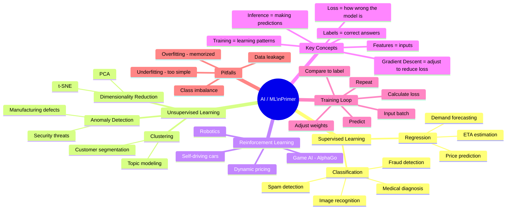

---

## Section 1: CPU vs GPU Model Selection

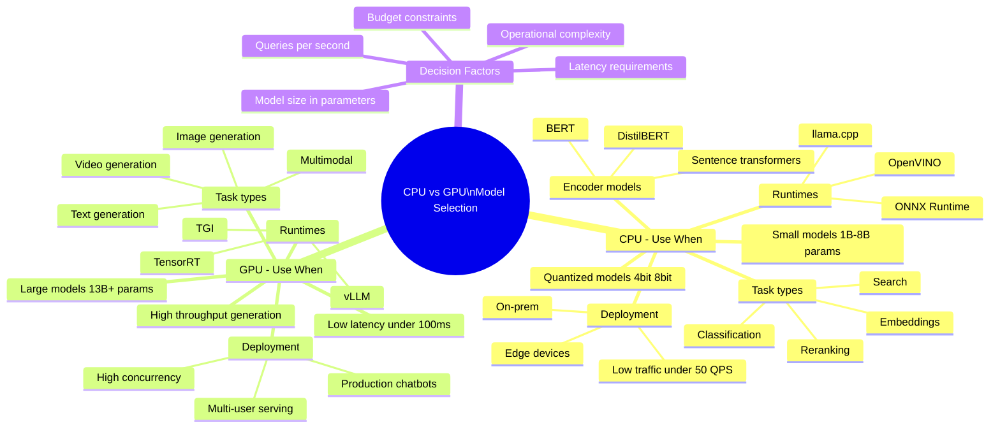

---

## Section 2: ML Metrics Framework

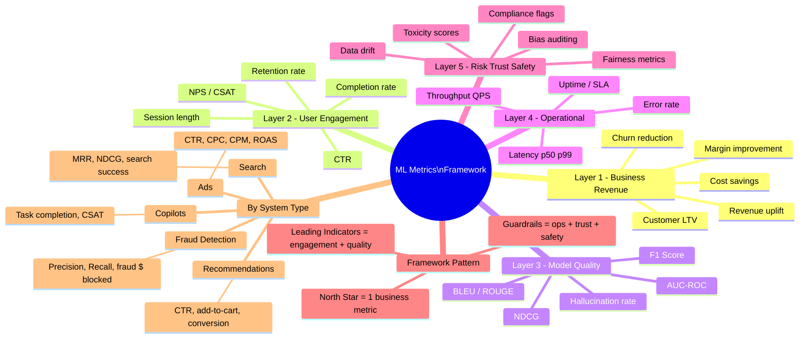

---

## Section 3: System Design Steps

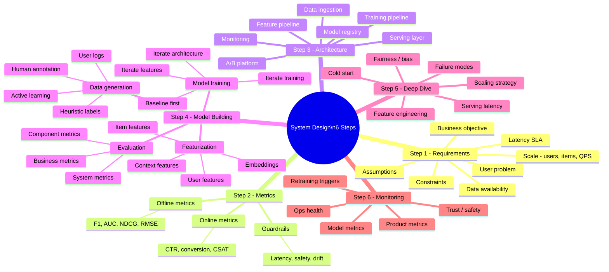

---

## Section 4: Offline vs Online Metrics

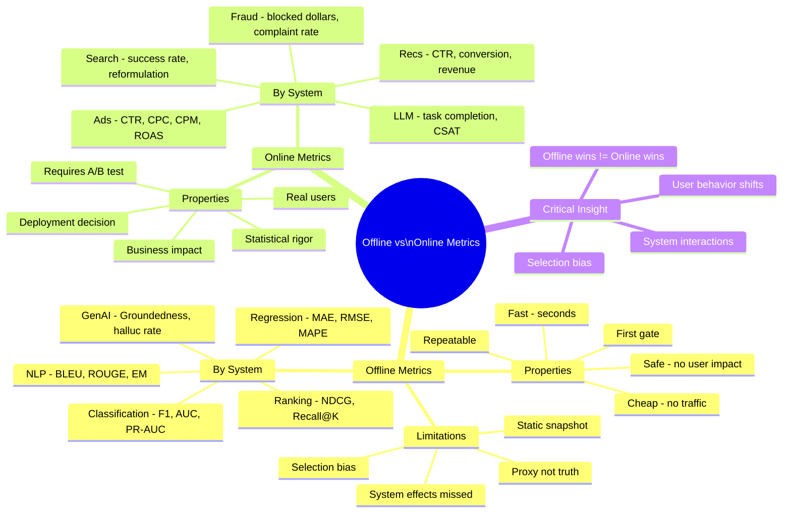

---

## Section 5: Business Metrics

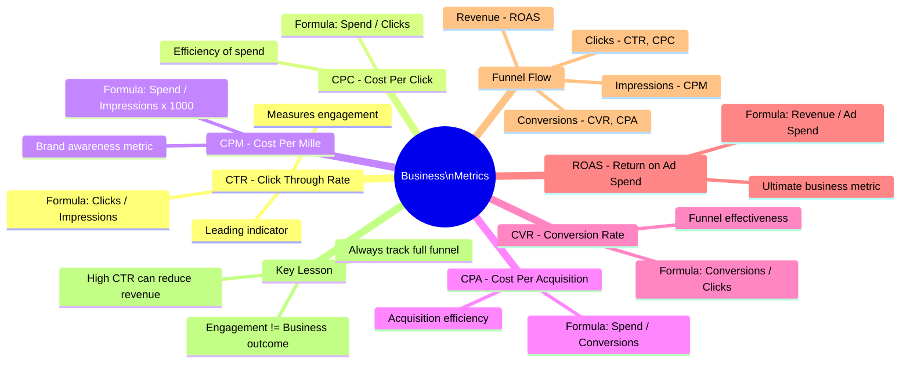

---

## Section 6: Offline Metrics Deep Dive

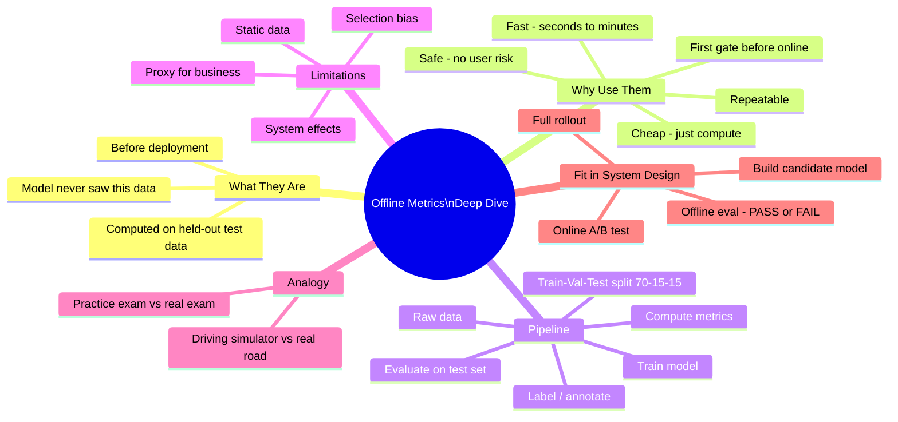

---

## Section 7: Metrics by Model Type

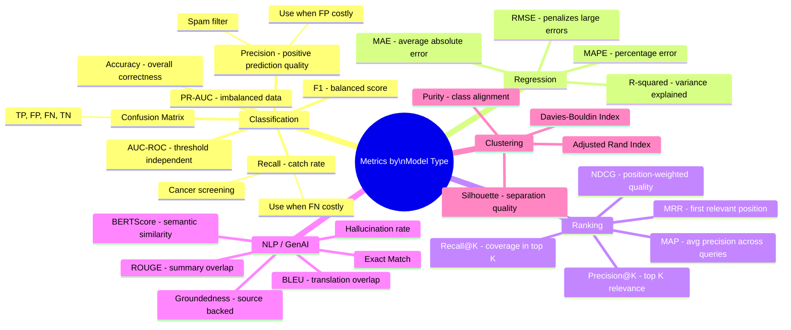

---

## Model Selection Guide

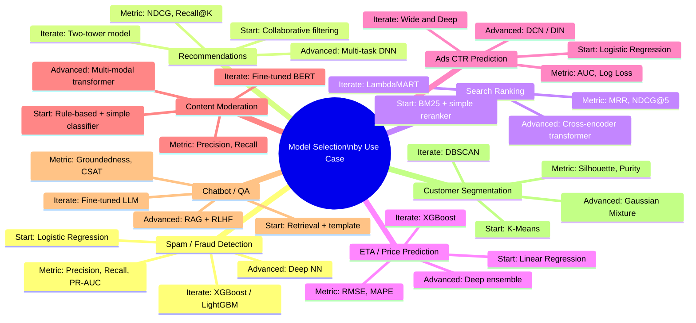

---

## Search Relevance Architecture

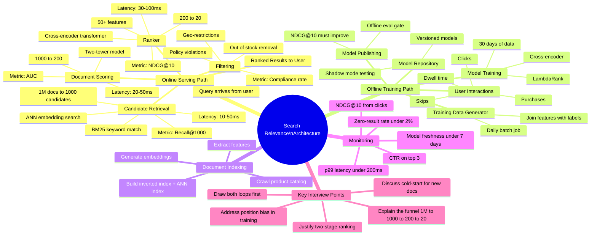

---

## Metrics Explainer — What Each Metric Actually Means

> If you only read one section, read this. Every metric explained in plain English with real-world analogies.

### Classification Metrics Explained

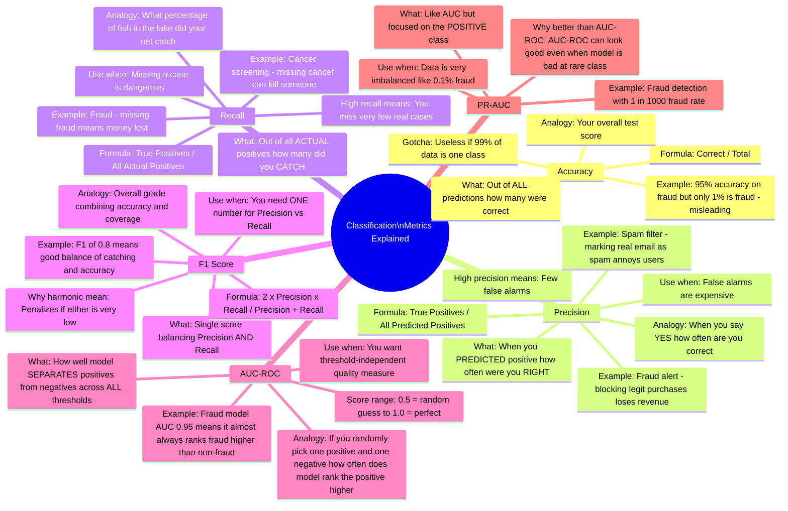

### Regression Metrics Explained

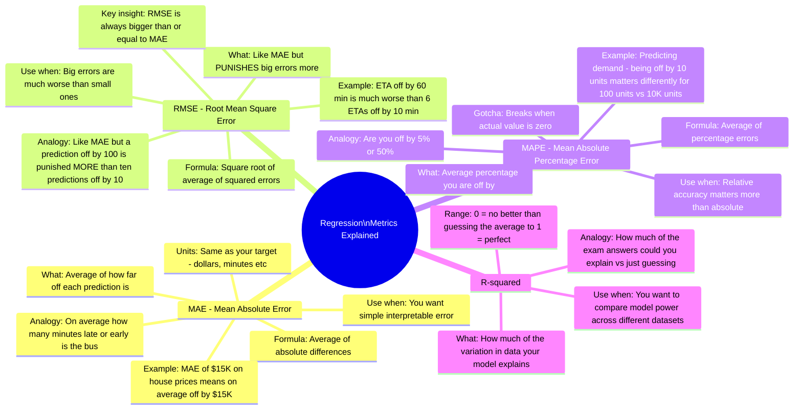

### Ranking Metrics Explained

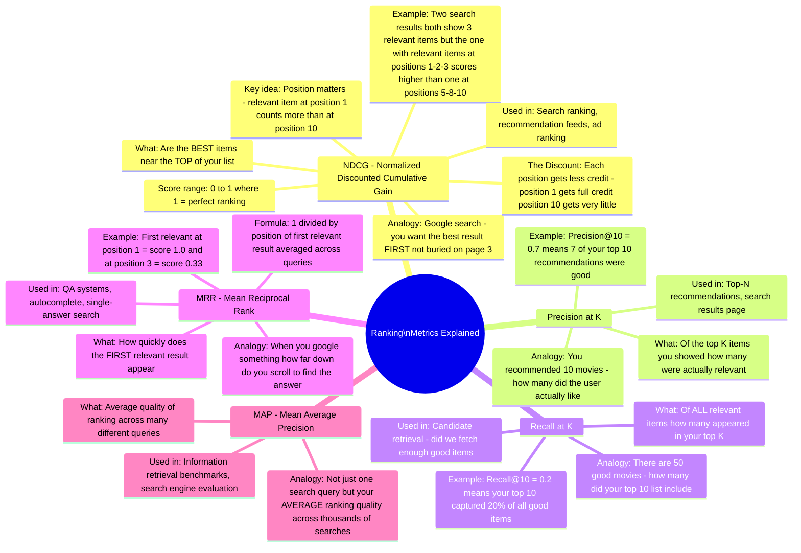

### NLP and GenAI Metrics Explained

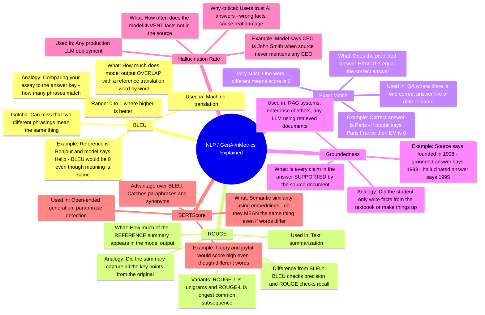

---

## Section 9: Interview Cheat Sheet

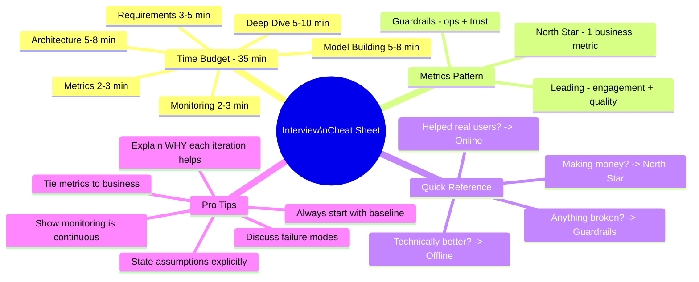
